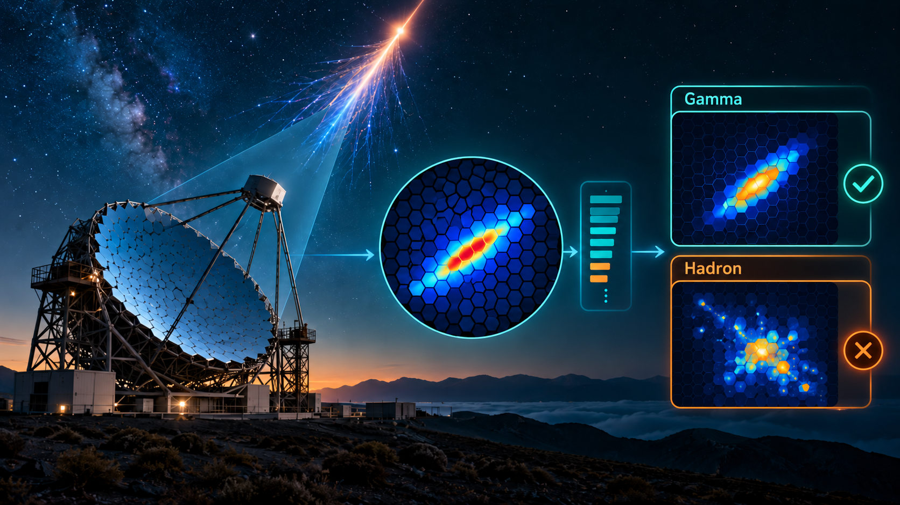

Welcome to my Data Science portfolio.

This portfolio presents selected projects in machine learning,
data analysis, and model evaluation.

## Projects

### MAGIC Gamma Telescope Classification

  <figure style="margin:0; flex:0 1 320px; text-align:center;">
    

    <figcaption style="margin-top:8px; font-size:0.85em; color:#666;">
      AI-generated illustration of the MAGIC gamma/hadron classification workflow.
    </figcaption>
  </figure>

  

    <h3>MAGIC Gamma Telescope Classification</h3>

    

      Machine-learning classification of gamma-ray induced showers and hadronic
      background events using domain-specific ROC operating points.
    

    

      <a href="projects/magic-gamma/">View project →</a>
    

  

[View project](projects/magic-gamma/)
