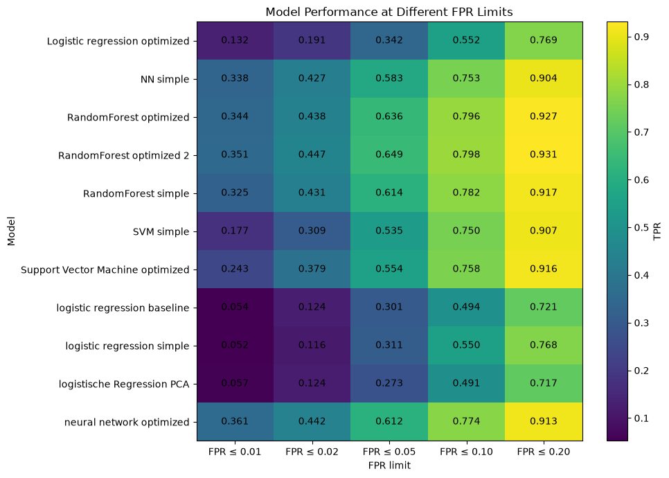
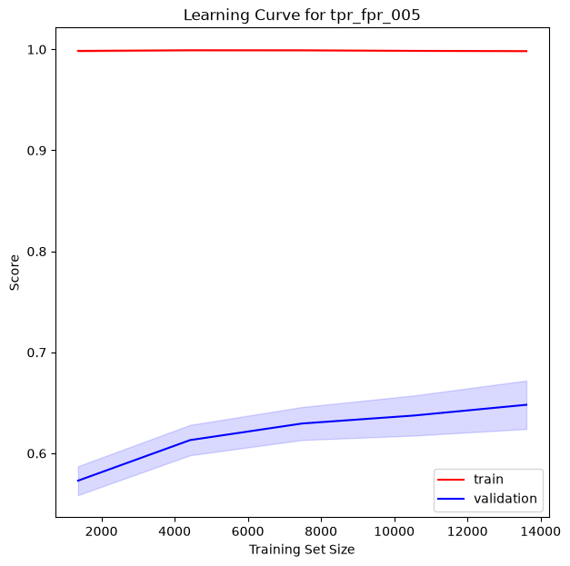
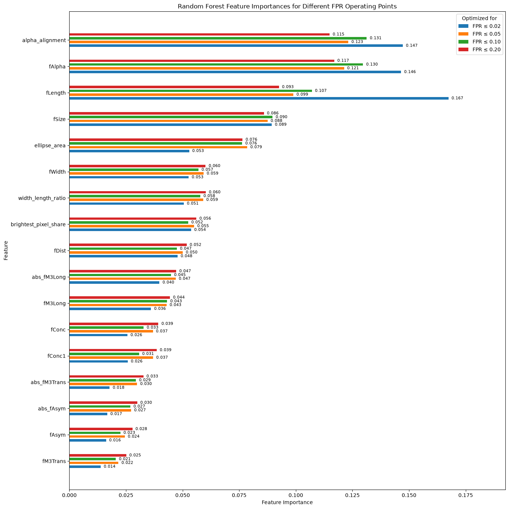
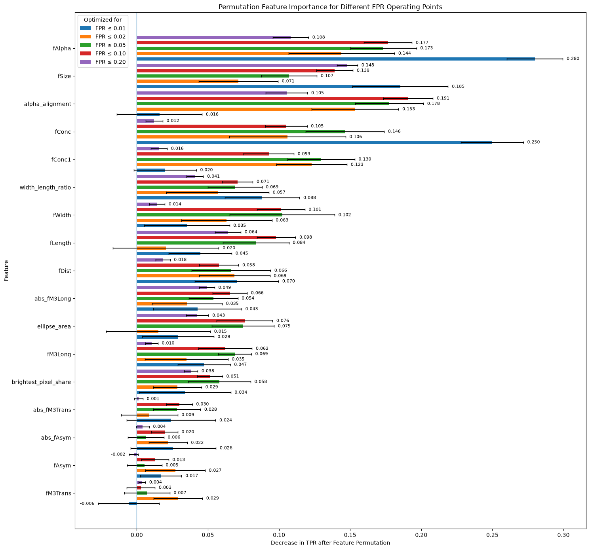

# Gamma/Hadron Classification with the MAGIC Gamma Telescope Dataset

## Machine Learning for Background Rejection in Gamma-Ray Astronomy

This project investigates the classification of **gamma-ray induced particle showers** and **hadronic background events** recorded by an Imaging Atmospheric Cherenkov Telescope.

The main challenge is not simply to maximize classification accuracy. In this application, falsely classifying a hadronic background event as a gamma event is particularly undesirable.

The models are therefore evaluated at predefined limits of the **False Positive Rate (FPR)**, while maximizing the corresponding **True Positive Rate (TPR)**.

---

## Project at a Glance

| | |
|---|---|
| **Task** | Binary classification |
| **Signal** | Gamma-ray events |
| **Background** | Hadronic cosmic-ray events |
| **Dataset** | MAGIC Gamma Telescope |
| **Observations** | ~19,000 |
| **Original Features** | 10 continuous image parameters |
| **Primary Metric** | TPR at FPR ≤ 0.05 |
| **Additional Operating Points** | FPR ≤ 0.01, 0.02, 0.10, 0.20 |
| **Models** | Logistic Regression, SVM, Neural Network, Random Forest |
| **Hyperparameter Optimization** | Bayesian Optimization with Optuna |
| **Best Model Family** | Optimized Random Forest |

---

## Why Accuracy Is Not Enough

The target is encoded as:

```text
Gamma event  → 1
Hadron event → 0
```

For this definition:

- **True Positive Rate (TPR)** measures the fraction of gamma events correctly identified.
- **False Positive Rate (FPR)** measures the fraction of hadron events incorrectly classified as gamma events.

The goal is therefore:

> **Maximize gamma efficiency while keeping the accepted hadronic background below a predefined limit.**

The following operating points are investigated:

```text
FPR ≤ 0.01
FPR ≤ 0.02
FPR ≤ 0.05
FPR ≤ 0.10
FPR ≤ 0.20
```

A custom scoring function is used to determine the maximum achievable TPR within each FPR limit.

The **5% FPR operating point** is used as the primary model-selection criterion, while the remaining operating points provide additional insight into model behavior.

---

## Dataset

The dataset contains approximately 19,000 simulated atmospheric shower events and ten numerical image parameters describing the geometry, intensity, concentration, asymmetry, and orientation of the Cherenkov light images.

The target classes are moderately imbalanced:

```text
Gamma events:  ~65%
Hadron events: ~35%
```

No missing values are present.

Extreme values identified during the univariate analysis were retained because they did not appear anomalous in the multivariate analysis.

### Selected Original Features

| Feature | Description |
|---|---|
| `fLength` | Length of the shower image along its major axis |
| `fWidth` | Width of the shower image along its minor axis |
| `fSize` | Log-transformed total light content |
| `fConc` | Light concentration in the two brightest pixels |
| `fConc1` | Light concentration in the brightest pixel |
| `fAsym` | Position of the brightest pixel along the major axis |
| `fM3Long` | Longitudinal asymmetry of the light distribution |
| `fM3Trans` | Transverse asymmetry of the light distribution |
| `fAlpha` | Orientation of the shower image relative to the camera center |
| `fDist` | Distance between the image center and the camera center |

---

## Exploratory Data Analysis

The exploratory analysis included:

- feature distributions
- class-dependent distributions
- outlier analysis
- correlation analysis
- multivariate relationships
- nonlinear dependencies
- investigation of feature redundancy

Several nonlinear relationships were identified, suggesting that nonlinear classifiers could provide an advantage over a purely linear baseline.

The analysis also indicated that the orientation of the shower image relative to the camera center is particularly informative for distinguishing gamma events from background.


---

## Feature Engineering

Several additional features were derived from the original image parameters.

Examples include:

```text
width_length_ratio
ellipse_area
abs_fAsym
abs_fM3Long
abs_fM3Trans
second_pixel_conc
brightest_pixel_share
alpha_alignment
```

These features provide additional representations of:

- shower-image geometry
- absolute asymmetry
- light concentration
- brightest-pixel dominance
- alignment with the camera center

For example:

```text
alpha_alignment = 1
```

represents perfect alignment of the shower image with the camera center.

---

## Modeling Workflow

The project follows a structured model-development process:

```text
Raw Data
   │
   ▼
Exploratory Data Analysis
   │
   ▼
Data Preparation
   │
   ▼
Feature Engineering
   │
   ▼
Baseline Model
   │
   ▼
Initial Model Training
   │
   ├── Logistic Regression
   ├── Support Vector Machine
   ├── Neural Network
   └── Random Forest
   │
   ▼
Bayesian Hyperparameter Optimization
   │
   ├── Optimized Logistic Regression
   ├── Optimized SVM
   ├── Optimized Neural Network
   └── Optimized Random Forest
   │
   ▼
Model Comparison
   │
   ├── Baseline Model
   ├── Simple Models
   └── Optimized Models
   │
   ▼
Cross-Validation Model Selection
   │
   ▼
Best Model for Each FPR Operating Point
   │
   ▼
Independent Test Evaluation
   │
   ▼
Learning Curves
   │
   ▼
Feature Importance Analysis
```

Each model family is first evaluated using a relatively simple configuration.

The corresponding model is then optimized using Bayesian hyperparameter optimization.

Only after both simple and optimized versions have been evaluated are the different models compared using cross-validation.

---

## Models Evaluated

### Logistic Regression

Logistic Regression is used as the linear baseline.

Additional experiments include:

- engineered features
- class weighting
- PCA
- Bayesian hyperparameter optimization

The model provides an interpretable reference for evaluating the benefit of nonlinear approaches.

---

### Support Vector Machine

Several nonlinear relationships were identified during the EDA, making an SVM with a nonlinear kernel particularly interesting.

The optimized parameters include:

```text
C
gamma
```

---

### Neural Network

A neural network based on scikit-learn's `MLPClassifier` is used to investigate whether neural-network-based models provide an advantage for this relatively small tabular dataset.

Different network architectures and training parameters are evaluated using Bayesian optimization.

---

### Random Forest

Random Forest showed the strongest performance during model development.

The model was therefore optimized using an extended search space including parameters such as:

```text
max_depth
min_samples_split
min_samples_leaf
max_features
class_weight
criterion
```

The optimized Random Forest ultimately provided the strongest overall performance across the investigated operating points.

---

## Handling Class Imbalance

Different approaches for handling the moderate class imbalance were compared using Logistic Regression.

The evaluated methods produced very similar performance.

For simplicity, subsequent models therefore use:

```python
class_weight="balanced"
```

where supported.

This avoids generating synthetic samples while still accounting for the unequal class distribution.

---

## Hyperparameter Optimization

Hyperparameter tuning is performed with **Optuna** using Bayesian optimization.

Importantly, optimization is not based on generic accuracy.

Instead, the models are optimized directly for the custom:

```text
TPR @ FPR ≤ threshold
```

metric.

This ensures that optimization focuses on the region of the ROC curve that is relevant for the scientific use case.

---

## Model Comparison

Both the simple and optimized versions of the different model families are compared
using stratified cross-validation on the training data.

The comparison shows that nonlinear models clearly outperform the linear baseline,
particularly at the more demanding low-FPR operating points.

The optimal model depends on the selected false-positive-rate constraint. At the
strictest operating point of **FPR ≤ 0.01**, the optimized neural network achieves the
best cross-validation performance. At **FPR ≤ 0.02**, the neural network and Random
Forest perform very similarly, with the Random Forest selected for the final
evaluation. From **FPR ≤ 0.05 onwards**, the optimized Random Forest provides the
strongest performance.

Overall, the optimized Random Forest is the strongest and most consistent model family
across the investigated operating points.



---

## Final Model Evaluation

The test dataset is kept completely separate during:

- model development
- feature engineering decisions
- hyperparameter optimization
- model comparison
- model selection

The best-performing model for each FPR operating point is selected exclusively based
on stratified cross-validation on the training data.

Only after the model-selection process is completed are the selected models evaluated
on the previously untouched test dataset.

This separation prevents information from the test set from influencing model
selection and provides a more realistic estimate of generalization performance.

### Final Results

| FPR Limit | Selected Model | CV TPR | Test TPR |
|---:|---|---:|---:|
| ≤ 0.01 | Optimized Neural Network | 0.361 | 0.361 |
| ≤ 0.02 | Optimized Random Forest | 0.442 | 0.393 |
| ≤ 0.05 | Optimized Random Forest | 0.636 | 0.668 |
| ≤ 0.10 | Optimized Random Forest | 0.796 | 0.814 |
| ≤ 0.20 | Optimized Random Forest | 0.927 | 0.935 |

The final test results are generally consistent with the cross-validation estimates,
indicating that the selected models generalize well to previously unseen data.

At **FPR ≤ 0.01**, the neural network achieves a test TPR of **0.361**, matching the
cross-validation result closely. At **FPR ≤ 0.02**, the Random Forest shows a somewhat
lower test performance than estimated during cross-validation.

For the operating points from **FPR ≤ 0.05 to FPR ≤ 0.20**, test performance is slightly
higher than the corresponding cross-validation estimate. This suggests that the
cross-validation procedure provided a realistic and, in these cases, slightly
conservative estimate of final model performance.

As expected, achievable gamma efficiency increases substantially as the allowed
false-positive rate is relaxed. The results therefore highlight the trade-off between
strong background rejection and gamma detection efficiency.

Overall, the optimized Random Forest provides the strongest and most consistent
performance across the practically relevant operating points, while the optimized
neural network performs best in the most restrictive **FPR ≤ 0.01** regime.

## Learning Curves

Learning curves were used to investigate model generalization and the effect of additional training data.

The results show that very restrictive FPR operating points are substantially more difficult.

At:

```text
FPR ≤ 0.01
FPR ≤ 0.02
```

a pronounced gap between training and validation performance remains.

This indicates higher model variance and reflects the increased statistical sensitivity of the low-FPR region.

For less restrictive operating points, particularly:

```text
FPR ≤ 0.20
```

training and validation performance are considerably closer.

The validation curves continue to improve with increasing training-set size for several operating points, indicating that additional data could further improve performance.

<table>
  <tr>
    <td align="center">
      
      <br>
      <b>FPR ≤ 0.05</b>
    </td>
    <td align="center">
      
      <br>
      <b>FPR ≤ 0.20</b>
    </td>
  </tr>
</table>

---

## Model Interpretation

Two complementary approaches are used to investigate feature importance.

### Random Forest Feature Importance

The built-in Random Forest importance shows relatively stable patterns across the different FPR operating points.

Features related to the following properties are particularly relevant:

- shower orientation
- image size
- image morphology
- light concentration

`fAlpha` and its engineered representation `alpha_alignment` are among the most important features.

Because these two features contain strongly overlapping information, their individual importance values should not be interpreted independently.

<!-- Replace with your actual image -->


---

### Permutation Feature Importance

Permutation importance was calculated using the same custom TPR-at-FPR scorer used for model evaluation.

This makes it possible to investigate how strongly each feature contributes specifically to model performance at a given FPR operating point.

The analysis confirms the importance of shower orientation and additionally highlights features such as:

```text
fConc
fConc1
fSize
fLength
fWidth
width_length_ratio
ellipse_area
```

The results suggest that the most relevant sources of discriminative information are:

1. **shower-image orientation**
2. **light concentration**
3. **image size**
4. **image morphology**

Because several original and engineered features are correlated, feature importance is interpreted at the level of information groups rather than as completely independent contributions.

<!-- Replace with your actual image -->


---

## From Simulation to Real MAGIC Observations

### Why Add Real MAGIC Data?

The machine-learning part of this project uses simulated MAGIC events for which the true class is known:

```text
Gamma event  -> signal
Hadron event -> background
```

This makes supervised learning possible. The model can learn which event characteristics are typical for gamma rays and which are more typical for background events.

Real telescope observations are different.

At DL3 level, the data no longer contain the original shower-image features used by the machine-learning model. Individual events also do not have gamma/hadron ground-truth labels.

Instead, DL3 provides already reconstructed quantities such as:

- reconstructed energy
- reconstructed sky position
- event time
- instrument-response information
- observation metadata

This means that the trained UCI classifier cannot simply be applied directly to the DL3 data.

The DL3 analysis was therefore added as a **reality check** for the machine-learning study.

Both parts address the same scientific problem:

> **How can a relatively small gamma-ray signal be separated from a much larger background?**

The difference lies in the available information and therefore in the analysis method:

```text
Simulation / Machine Learning

Known gamma/hadron labels
        ↓
Classify individual events
        ↓
Evaluate gamma efficiency
and false-positive rate


Real DL3 Observations

No event-level gamma/hadron labels
        ↓
Estimate background statistically
        ↓
Search for an excess
from the source direction
```

---

### How Is a Gamma-Ray Signal Found in Real Data?

The **Crab Nebula** is a well-known gamma-ray source and is used here as a real-world test case.

The analysis compares two types of sky regions:

- **ON region:** the region where the Crab Nebula is located
- **OFF regions:** nearby control regions used to estimate the background

The basic idea is:

```text
events in ON region
- expected background
= gamma-ray excess
```

Because several OFF regions can be used, their event count is scaled by a normalization factor called `alpha`.

```text
background = alpha × N_OFF

excess = N_ON - background
```

The **excess** is not a list of individually confirmed gamma rays.

It is a statistical estimate of how many more events were observed from the source direction than would be expected from background alone.

A second quantity, the **detection significance**, describes how convincing this excess is. A large significance means that the observed excess is very unlikely to be caused only by random background fluctuations.

<p align="center">
  
</p>

---

### Real-Data Workflow

The DL3 analysis follows a simple workflow:

```text
Load real MAGIC DL3 observations
        ↓
Define source region (ON)
and background regions (OFF)
        ↓
Estimate the expected background
        ↓
Calculate gamma-ray excess
and detection significance
        ↓
Compare different
observing conditions
```

This analysis was first tested on a single observation and was then extended to larger groups of observations.

---

### First Real Observation

The workflow was first validated on one approximately 20-minute Crab Nebula observation.

| Quantity | Result |
|---|---:|
| Livetime | 19.6 min |
| Events in ON region | 426 |
| Estimated background | 148.7 |
| Gamma-ray excess | 277.3 |
| Detection significance | 15.1 sigma |

In simple terms:

> The telescope recorded substantially more events from the Crab Nebula direction than would be expected from background alone.

This confirms that the analysis pipeline can detect the known gamma-ray source in real telescope data.

<p align="center">
  
</p>

---

### Influence of Night-Sky Background

Real telescope observations are affected by changing environmental conditions.

One important example is **Night-Sky Background (NSB)**, especially additional light caused by moonlight.

MAGIC detects very short and faint flashes of Cherenkov light produced by particle showers in the atmosphere. A brighter night sky makes weak Cherenkov signals more difficult to distinguish reliably from optical background light.

The analysis therefore compares observations under different NSB conditions.

Under the brightest conditions:

- the minimum reliably usable energy increases from about **0.12 TeV to 0.19 TeV**
- the measured gamma-ray excess rate decreases to about **450 events per hour**

Under dark or low-background conditions, the excess rate is approximately **850–880 events per hour**.

<p align="center">
  
</p>

<p align="center">
  
</p>

A simple interpretation is:

> **Bright sky conditions make weak gamma-ray events more difficult to detect reliably.**

The observation groups are not perfectly controlled experiments and differ in size and observing conditions. The result should therefore be interpreted as a comparison of real observational samples rather than as an exact measurement of telescope sensitivity.

---

### Influence of Camera Offset

The analysis also investigates whether the position of the source inside the camera influences the observed signal.

The **camera offset** describes the angular distance between the source position and the telescope pointing direction.

A small offset means that the source lies relatively close to the center of the camera field of view.

A larger offset places the source farther towards the edge of the camera.

The measured excess rate decreases strongly at larger offsets:

```text
0.40° offset -> about 904 excess events/hour
1.00° offset -> about 462 excess events/hour
1.40° offset -> about 251 excess events/hour
```

<p align="center">
  
</p>

This behavior is consistent with a weaker telescope response when the source is observed farther away from the camera center.

Some offset groups contain only a small number of observations and should therefore be interpreted cautiously.

---

### Combined Multi-Offset Detection

All 71 multi-offset observations were also combined into one stacked analysis.

| Quantity | Result |
|---|---:|
| Number of observations | 71 |
| Total livetime | 21.16 h |
| Events in ON region | 17,826 |
| Estimated background | 3,985 |
| Gamma-ray excess | 13,841 |
| Detection significance | 124.9 sigma |

The Crab Nebula is therefore detected very clearly across the complete multi-offset observation sample.

Again, the excess represents a **statistical source signal**, not 13,841 individually identified gamma rays.

---

### Connection to the Machine-Learning Part

The machine-learning analysis and the DL3 analysis use different data and different methods, but they address the same underlying problem:

> **How can a relatively small gamma-ray signal be separated from a much larger background?**

The two datasets represent different stages of the analysis chain.

| Machine Learning on Simulation | Real MAGIC DL3 Observations |
|---|---|
| Simulated events | Real telescope observations |
| Known gamma/hadron labels | No event-level truth labels |
| Shower-image features | Reconstructed energy and sky position |
| Supervised classification | Statistical signal extraction |
| TPR measures retained gamma events | Excess estimates source-associated events |
| FPR measures accepted background | OFF regions estimate real background |
| Model performance can be measured directly | Detection is evaluated statistically |

The most important difference is that the two datasets do **not contain the same features**.

The UCI dataset contains features describing the recorded Cherenkov shower image, for example its shape, size, concentration and orientation.

The DL3 dataset contains quantities that have already been reconstructed from earlier processing stages, such as energy and sky position.

Therefore:

```text
UCI simulation
shower-image features
        ↓
Machine-learning classifier
        ↓
gamma vs. hadron


Real DL3 data
different feature space
        ↓
no direct application
of the UCI classifier
        ↓
statistical ON/OFF analysis
```

---

### Why This Matters

The real-data analysis shows why good machine-learning performance on simulation is not the end of the story.

Real observations are influenced by additional effects such as:

- changing night-sky brightness
- source position inside the camera
- detector response
- calibration
- atmospheric conditions
- changing observing conditions

The DL3 analysis therefore adds an important second perspective to the project.

The machine-learning part shows:

> **How well can gamma and hadron events be separated when ground-truth labels are available?**

The real-data part shows:

> **How can a gamma-ray source be detected statistically when those labels are no longer available?**

---

### Main Takeaway

The relationship between the two parts can be summarized as:

> **Simulation allows signal-background separation to be learned and evaluated at the individual-event level. Real telescope observations require statistical evidence that a source signal remains above the background.**

In both cases, the central scientific challenge is the same:

> **Identify a relatively small gamma-ray signal within a much larger background population.**

The DL3 analysis therefore connects the machine-learning benchmark to the conditions encountered in real gamma-ray astronomy.

## Key Findings

The project produced several main findings:

**1. Domain-specific evaluation matters**

Accuracy would not adequately represent the requirements of this classification problem.

Evaluating TPR at predefined FPR limits provides a much more meaningful measure of model performance.

**2. Nonlinear models outperform the linear baseline**

SVM, neural-network, and Random-Forest models provide substantially stronger performance than simple Logistic Regression.

**3. Random Forest provides the strongest overall performance**

After hyperparameter optimization, Random Forest performs best across the investigated FPR operating points.

**4. Low-FPR classification is substantially more difficult**

Performance at `FPR ≤ 0.01` is considerably more challenging and less stable than performance at higher allowed background rates.

**5. Physically meaningful features dominate the model**

Shower orientation, light concentration, image size, and morphology provide the strongest discriminative information.

---

## Technologies

The project is implemented in Python and uses:

```text
Python
pandas
NumPy
Matplotlib
scikit-learn
imbalanced-learn
Optuna
Jupyter
Git
GitHub
```

The Python environment and dependencies are managed with `uv`.

---

## Repository

The complete project repository contains:

- exploratory notebooks
- preprocessing and feature-engineering code
- custom evaluation metrics
- model training and optimization
- final model evaluation
- learning curves
- feature-importance analyses

[View the complete project repository](https://github.com/k-skupin/MAGIC-Gamma-Telescope)

---

## Conclusion

This project demonstrates an end-to-end machine-learning workflow for a scientific binary-classification problem.

A central aspect of the project is the use of a **domain-specific evaluation strategy**.

Rather than optimizing generic accuracy, the models are evaluated according to their ability to maximize gamma efficiency while explicitly limiting the fraction of hadronic background events incorrectly classified as signal.

The comparison of several model families shows that nonlinear approaches substantially outperform the linear baseline.

Among the evaluated methods, the optimized Random Forest provides the strongest overall performance.

The combination of exploratory data analysis, physically motivated feature engineering, custom scoring, cross-validation, Bayesian optimization, learning-curve analysis, and feature-importance methods provides both strong predictive performance and insight into the underlying classification problem.


---

[← Back to Data Science Portfolio](../../)
